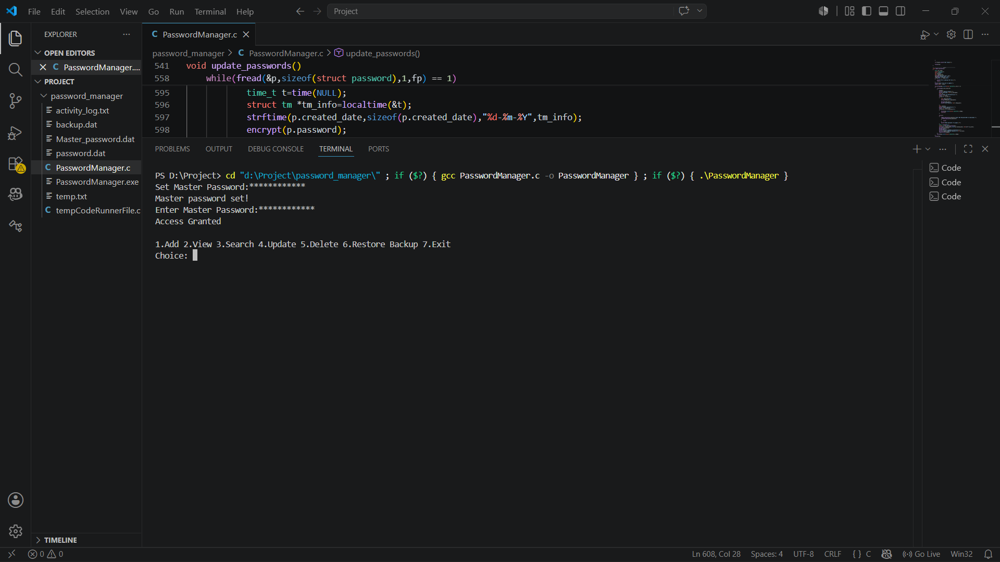
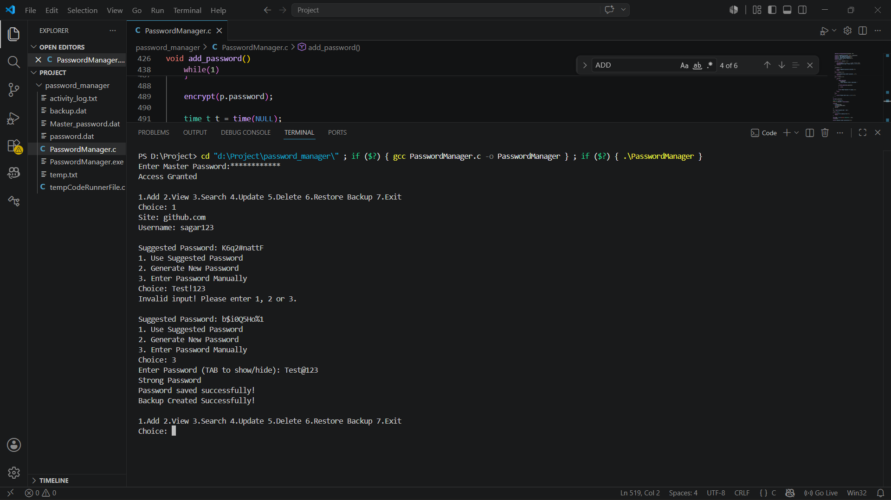
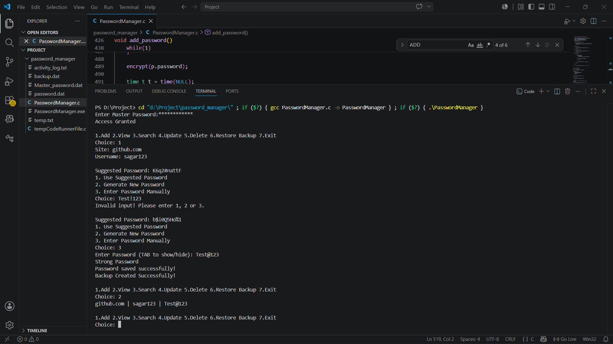
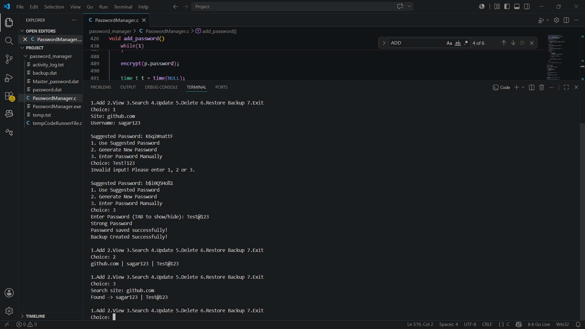
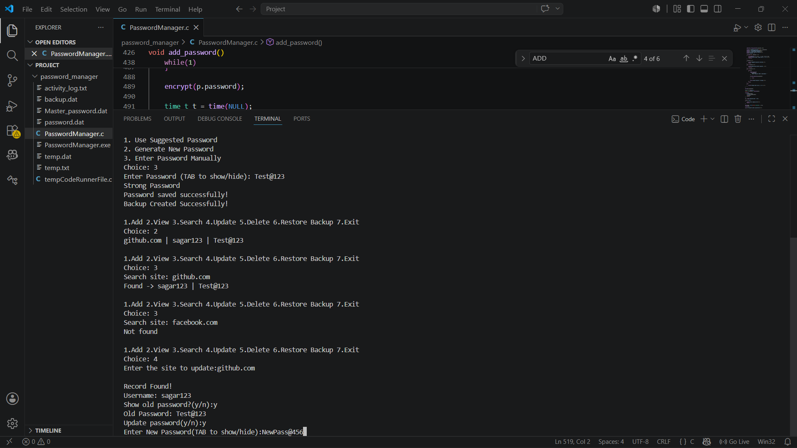
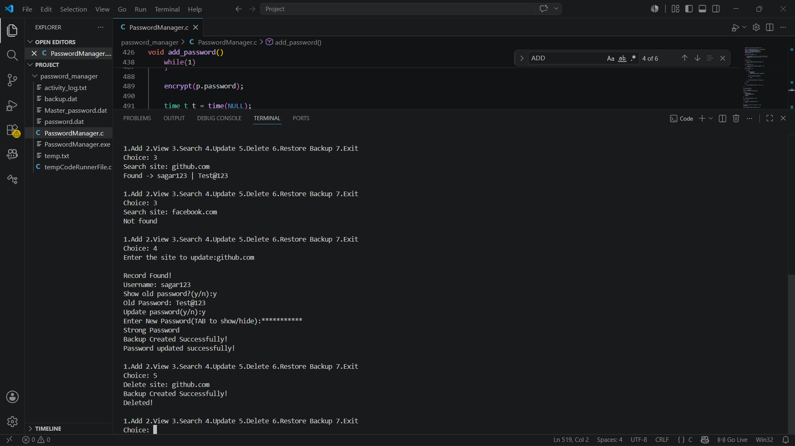
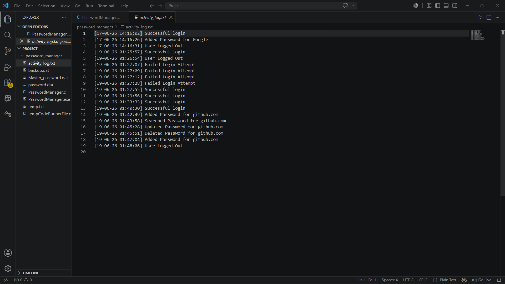
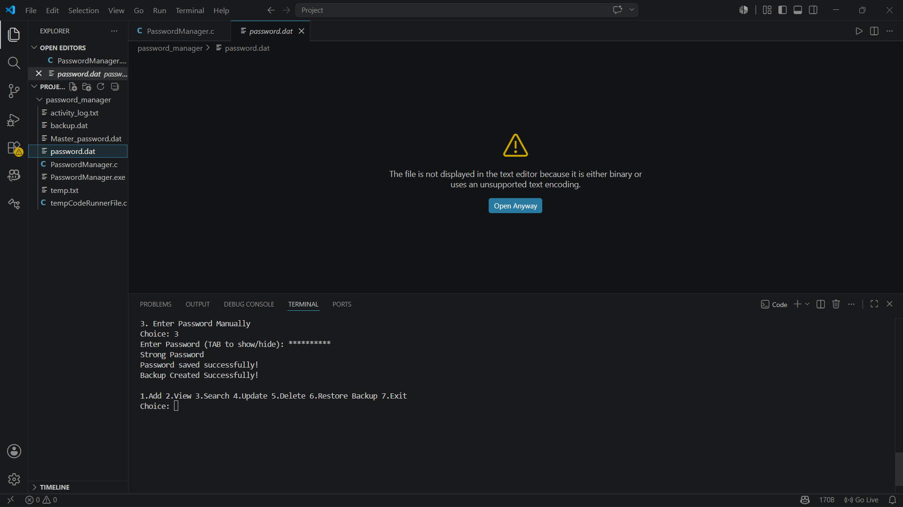
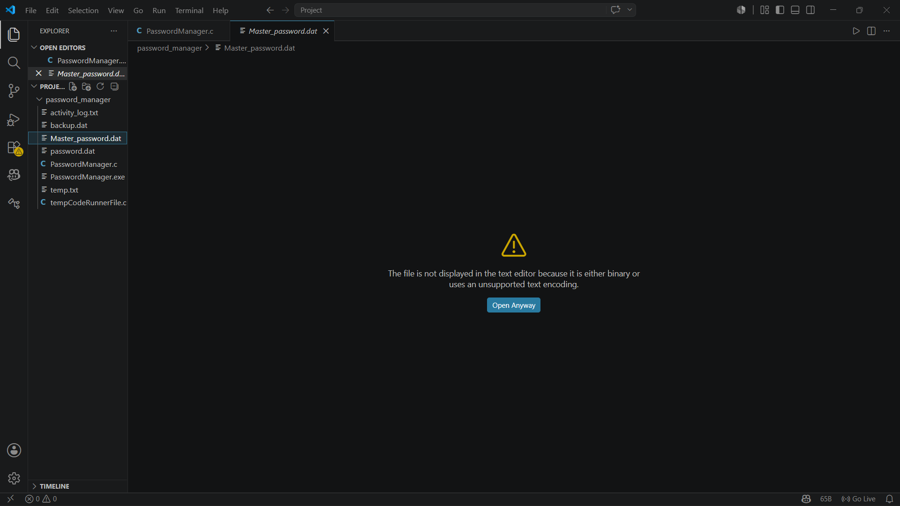
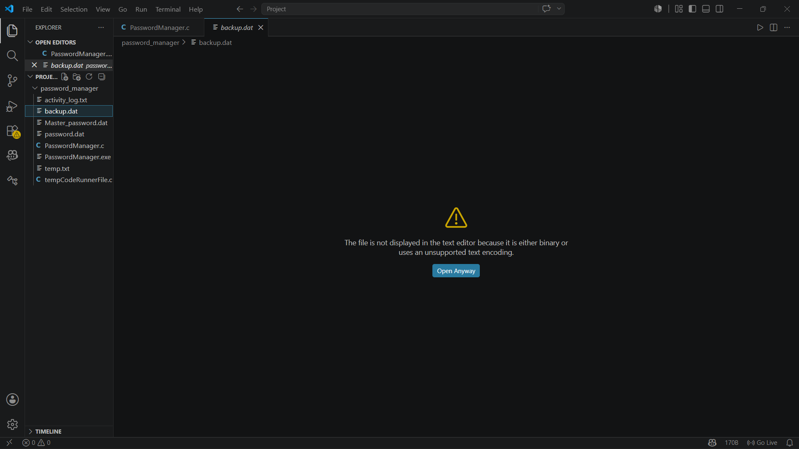

# Secure Password Manager in C

A password manager developed in C with secure credential storage and master password authentication.

## Features

* Master Password Authentication
* Add Password
* View Password
* Search Password
* Delete Password
* Password Encryption
* Activity Logging
* Automatic Backup

## Technologies Used

* C Programming
* File Handling
* Structures
* Basic Cryptography Concepts

## Compilation

gcc PasswordManager.c -o PasswordManager

## Run

./PasswordManager

## Screenshots

Screenshots demonstrating all features are available in the screenshots folder.

## Screenshots

### Master Password Login


### Add Password


### View Password


### Search Password


### Update Password


### Delete Password


### Activity Log


### Password Encryption


### Master Password Encryption


### Backup Encryption


## How to Compile

```bash
gcc PasswordManager.c -o PasswordManager
```

## How to Run

```bash
PasswordManager.exe
```

## Project Structure

Secure-Password-Manager-C
│
├── password_manager
│   ├── PasswordManager.c
│   └── screenshots
│
├── README.md
└── .gitignore

## Requirements

- GCC Compiler
- Windows OS
- Standard C Libraries

## Future Enhancements

- AES-256 Encryption
- Cloud Backup
- Multi-User Support
- Password Strength Analytics
- Two-Factor Authentication (2FA)
